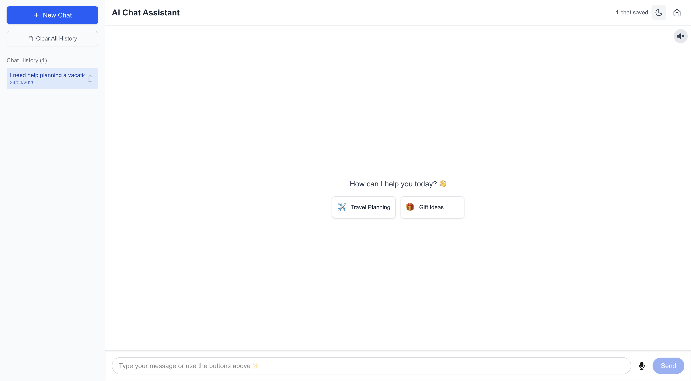

# Personal Recommendation Assistant

A modern, AI-powered recommendation system built with Next.js that specializes in providing personalized travel itineraries and gift recommendations.

## Demo

🔗 [Live Demo](https://ai-assistant-xzmb.vercel.app/)

[](https://ai-assistant-xzmb.vercel.app/)

## Features

- **Travel Itinerary Planning**: Get customized travel plans for any destination based on your preferences, budget, and timeframe
- **Gift Recommendations**: Find the perfect gift for any occasion, person, or budget
- **Chat Interface**: Intuitive chat-based interaction for natural conversations
- **Voice Chat**: Hands-free interaction using voice commands and text-to-speech responses
- **History Management**: Save and continue previous recommendation sessions
- **Dark/Light Mode**: Interface adapts to your preferred viewing mode


## Tech Stack

- **Frontend**: Next.js 14 with App Router
- **Styling**: Tailwind CSS
- **State Management**: Redux
- **Chat History**: Local storage persistence
- **Voice Recognition**: Web Speech API for voice input and output

## Getting Started

### Prerequisites

- Node.js 18+ 
- npm, yarn, or pnpm

### Installation

```bash
# Clone the repository
git clone https://github.com/ADHILSHA/ai-assistant.git
cd ai-assistant

# Install dependencies
npm install
# or
yarn install
# or
pnpm install
```

### Development

```bash
npm run dev
# or
yarn dev
# or
pnpm dev
```

Open [http://localhost:3000](http://localhost:3000) to view the application.

## Usage

1. Start a new chat from the homepage
2. Choose between travel itinerary planning or gift recommendation assistance
3. Use the microphone button to activate voice mode and speak your requests
4. For travel: Specify destination, budget, duration, and interests
5. For gifts: Describe the recipient, occasion, budget, and preferences
6. Receive personalized recommendations based on your inputs, with optional voice readout
7. Continue previous chats from the homepage if you have existing history

## Future Improvements

The following enhancements are planned for future releases:

1. **Testing Framework**: Complete and merge the testing suite from the tests/ branch to ensure application reliability
2. **User Authentication**: Implement secure login and personalized user profiles
3. **Saved Recommendations**: Allow users to save, organize, and favorite their travel itineraries and gift ideas
4. **E-commerce Integration**: Add direct purchase links for recommended gifts
5. **Travel Booking**: Integrate with flight and accommodation APIs to provide booking options for travel recommendations
6. **Offline Mode**: Enable basic functionality when users are offline with cached recommendations
7. **Multi-language Support**: Expand the application to support multiple languages for global users

## License

MIT
